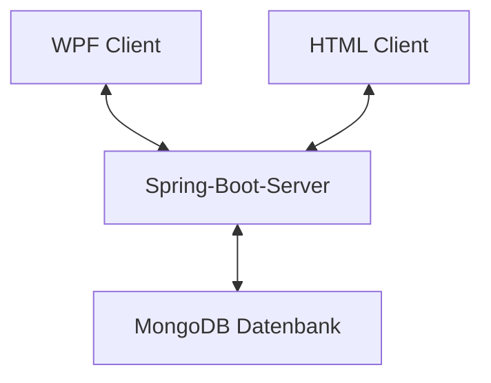
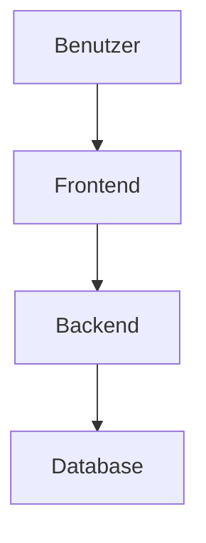
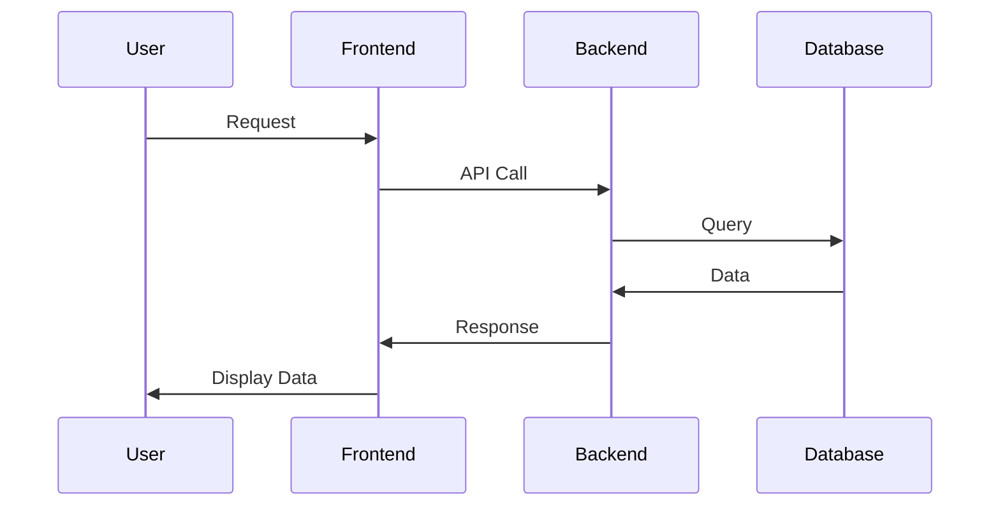
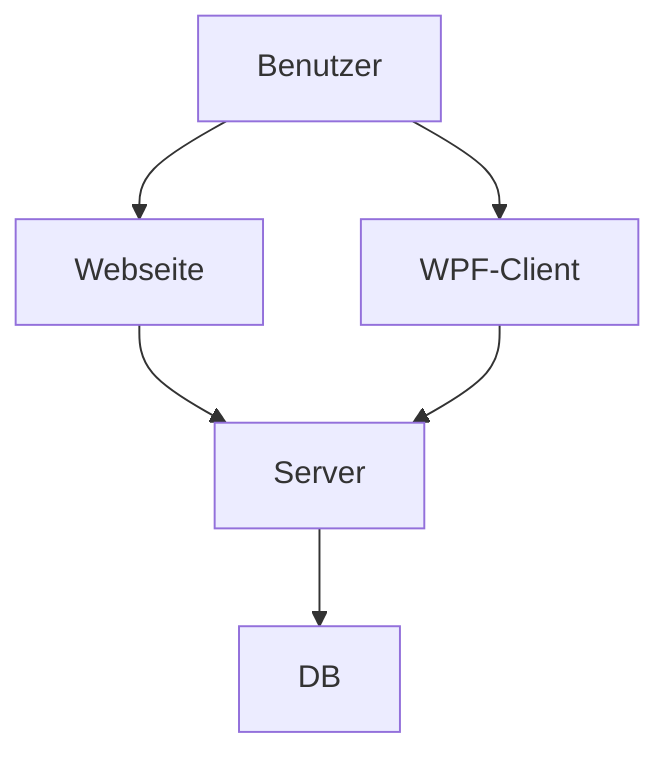

# POS Projekt 2024 - Notiz App - Paul Wasle
- Softwaredesign (Architektur) 
- Beschreibung der Software (was tut sie und wozu ist sie gut) 
- API-Beschreibung
- Verwendung der API (ev. mit Code-Ausschnitten)
- Ev. Diagramme (Use-Cases, Übersichtsdiagramme)
- Diskussion der Ergebnisse (Zusammenfassung, Hintergründe, Ausblick, etc.)
- Quellenverzeichnis / Links
- Und wichtig: Die Grafiken müssen mittels Mermaid erstellt werden! (GitHub bietet eine Unterstützung für Mermaid-Diagramme)

## Softwaredesign (Architektur)
Die Notiz-App basiert hauptsächlich auf einen Spring-Boot-Server. Dieser bildet die Basis und stellt eine Verbindung zu einer MongoDB-Datenbank bereit. Mithilfe von Clients kann man auf diese Datenbank zugreifen und die Daten abfragen, senden, löschen oder ändern. Ein Client wurde mit C# und WPF entwickelt, der andere wurde in das Spring-Boot-Projekt direkt eingebunden und basiert auf HTML, CSS und JavaScript.




## Beschreibung der Software
Die Notiz-App ermöglicht es dem Benutzer sich entweder über den Browser oder einer Desktop-Anwendung mit dem Server zu verbinden und Notizen zu erstellen. Diese können anschließend inhaltlich auch wieder verändert werden. Zusätzlich können Notizen auch als erledigt makiert oder auch gelöscht werden. Jede dieser genannten Funktionen sendet ein Update an den Server und folglich auch an die Datenbank, in der die Daten entweder erstellt, geändert oder gelöscht werden.


## Funktionen der webbasierten Notiz-App

### Erstellen einer Notiz
<br>
<br>
Beim Drücken auf das Element im ersten Bild wird man in das zweite Fenster geleitet, wo man den Inhalt eingeben kann.

### Anzeigen der Notizen
<br>

### Erledigen einer Notiz
<br>

### Ändern einer Notiz
<br>
<br>

### Löschen einer Notiz
<br>
<br>


## Einleitung
Beschreibe hier kurz, worum es bei diesem Projekt geht. Zum Beispiel:

Dieses Projekt ist eine Beispielanwendung, die zeigt, wie man eine einfache API mit Node.js und Express erstellt.

## Installation
Erkläre, wie man das Projekt installiert und welche Voraussetzungen erfüllt sein müssen.

### Voraussetzungen
- Node.js (Version 14 oder höher)
- npm (Version 6 oder höher)

### Schritte
1. Klone das Repository:
    ```sh
    git clone https://github.com/username/repository.git
    ```
2. Wechsle in das Projektverzeichnis:
    ```sh
    cd repository
    ```
3. Installiere die Abhängigkeiten:
    ```sh
    npm install
    ```

## Benutzung
Beschreibe, wie man das Projekt benutzt.

### Starten der Anwendung
```sh
npm start
```

repository/
├── node_modules/
├── src/
│   ├── controllers/
│   ├── models/
│   ├── routes/
│   ├── app.js
├── test/
├── package.json
├── README.md





### Erklärung der Inhalte:

- **Einleitung**: Kurze Einführung und Ziel des Projekts.
- **Installation**: Schritte zur Installation und erforderliche Voraussetzungen.
- **Benutzung**: Anleitung zum Starten und Verwenden der Anwendung.
- **Architektur**: Beschreibung der Projektstruktur und visuelle Darstellung mittels Mermaid-Diagrammen.
- **API-Referenz**: Detaillierte Beschreibung der verfügbaren API-Endpunkte.
- **Datenflussdiagramm**: Visuelle Darstellung des Datenflusses innerhalb der Anwendung.
- **Tests**: Anleitung zum Ausführen von Tests.
- **Beitragende**: Liste der Projektmitarbeiter.
- **Lizenz**: Informationen zur Lizenzierung des Projekts.

Mermaid-Grafiken helfen dabei, die Architektur und den Datenfluss verständlicher darzustellen. Diese Vorlage kann nach Bedarf angepasst und erweitert werden.


---





### Notiz App
- Softwaredesign (Architektur) 
- Beschreibung der Software (was tut sie und wozu ist sie gut) 
- API-Beschreibung
- Verwendung der API (ev. mit Code-Ausschnitten)
- Ev. Diagramme (Use-Cases, Übersichtsdiagramme)
- Diskussion der Ergebnisse (Zusammenfassung, Hintergründe, Ausblick, etc.)
- Quellenverzeichnis / Links
- Und wichtig: Die Grafiken müssen mittels Mermaid erstellt werden! (GitHub bietet eine Unterstützung für Mermaid-Diagramme)
