# POS Projekt 2024 - Notiz App - Paul Wasle

**Eine Notiz-App, welche im Auftrag des POS-Projektes von Paul Wasle geplant, implementiert und dokumentiert wurde.**

## Softwaredesign (Architektur)
Die Notiz-App basiert hauptsächlich auf einen Spring-Boot-Server. Dieser bildet die Basis und stellt eine Verbindung zu einer MongoDB-Datenbank bereit. Mithilfe von Clients kann man auf diese Datenbank zugreifen und die Daten abfragen, senden, löschen oder ändern. Ein Client wurde mit C# und WPF entwickelt, der andere wurde in das Spring-Boot-Projekt direkt eingebunden und basiert auf HTML, CSS und JavaScript.

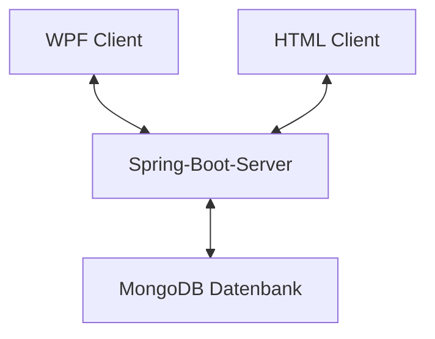


## Beschreibung der Software
Die Notiz-App ermöglicht es dem Benutzer sich entweder über den Browser oder einer Desktop-Anwendung mit dem Server zu verbinden und Notizen zu erstellen. Diese können anschließend inhaltlich auch wieder verändert werden. Zusätzlich können Notizen auch als erledigt markiert oder auch gelöscht werden. Jede dieser genannten Funktionen sendet ein Update an den Server und folglich auch an die Datenbank, in der die Daten entweder erstellt, geändert oder gelöscht werden.


## Funktionen der webbasierten Notiz-App
Die IP-Adresse des Servers muss nicht manuell eingegeben werden, sondern wird automatisch basierend auf die IP-Adresse des Geräts zugewiesen. 

### Erstellen einer Notiz
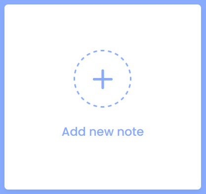
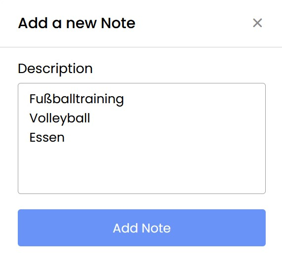<br>
Beim Drücken auf das Element im ersten Bild wird man in das zweite Fenster geleitet, wo man den Inhalt eingeben kann. <br>
Ist man mit dem Inhalt zufrieden, so betätigt man "Add Note". Die Notiz wird nun in der Datenbank angelegt.

### Anzeigen der Notizen
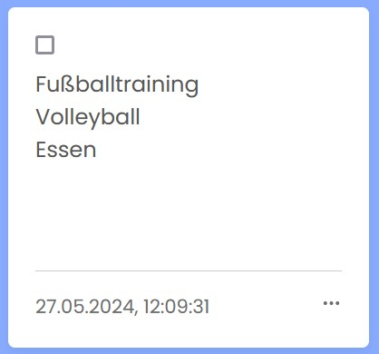<br>
Nach dem Anlegen einer Notiz oder auch dem Laden von der Datenbank werden die Notizen wie im Bild zu sehen im Browser angezeigt. <br>
Unten links kann man das Datum sehen, an welchem die Notiz angelegt wurde. <br>
In der Mitte befindet sich der Inhalt der Notiz und oben wird die Checkbox für das Erledigen der Notiz angezeigt. <br>
Außerdem kann man rechts unten noch die drei Punkte sehen, welche, wie später noch beschrieben, die Möglichkeiten für das Ändern und Löschen der Notiz beinhalten.

### Erledigen einer Notiz
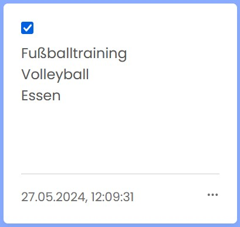<br>
Die zuvor erwähnte Checkbox dient nun zum Markieren der erledigten Notizen. Durch einfaches anklicken wird die Notiz als Erledigt markiert und diese Info auch wieder in der Datenbank gespeichert. Bei erneutem Laden der Webseite bleibt die Notiz erledigt. 

### Ändern einer Notiz
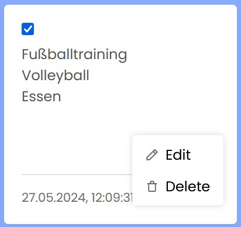
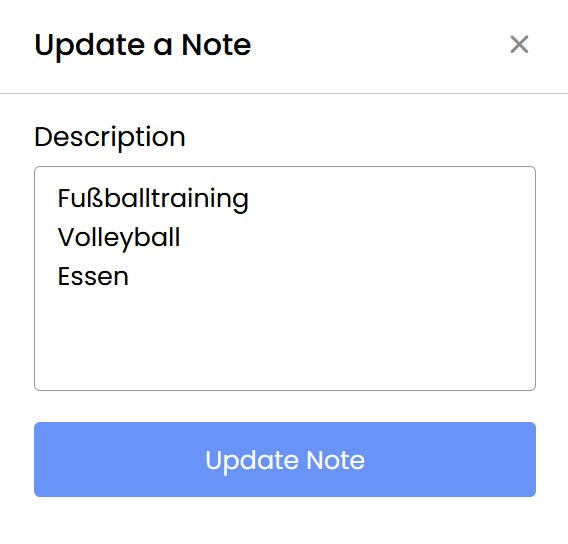<br>
Über die drei Punkte kann man nun zwischen dem Ändern oder dem Löschen entscheiden. <br>
Entscheidet man sich für das Ändern der Notiz, so wird man, wie beim Erstellen einer Notiz in das bereits bekannte Fenster geleitet, wobei man jetzt den aktuellen Inhalt der Notiz im Inhaltsfeld sehen kann. Nun kann man die gewünschte Änderung durchführen und den Button "Update Note" betätigen, was zum Update der Notiz in der Datenbank und der Webapp führt.


### Löschen einer Notiz

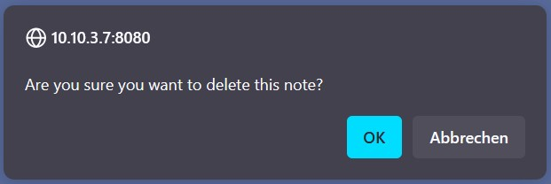<br>
Entscheidet man sich jedoch für das Löschen der Notiz so wird durch ein weiteres Fenster nochmals sichergestellt, dass das Löschen wirklich beabsichtigt war. <br>
Sollte man dies bestätigen, so wird die Notiz in der Webapp und der Datenbank gelöscht. 


## Funktionen der WPF-Anwendung
Die IP-Adresse des WPF-Clients muss im Gegensatz zum Server manuell eingegeben werden. Im Code muss man hierbei, wie im folgenden Code-Ausschnitt gezeigt, die IP-Adresse auf die des Servers setzen. Die Server-IP wird bei Starten des Servers in der Konsole ausgegeben.

```csharp
public static string serverAddress = "IP-Adresse des Servers";
```

### Erstellen einer Notiz
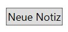 <br>
Das Drücken des Buttons auf dem ersten Bild führt zum Erstellen einer neuen Notiz, welche dann wie im nächsten Punkt dargestellt wird. Im Hintergrund wird eine neue Notiz in der Datenbank angelegt.

### Anzeigen der Notizen
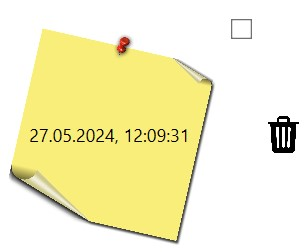
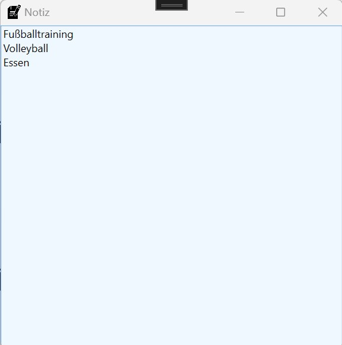<br>
Nach dem Anlegen einer Notiz oder auch dem Laden von der Datenbank werden die Notizen wie im Bild zu sehen im Fenster angezeigt. <br>
In der Mitte der Notiz, ist das Datum, an dem die Notiz erstellt wurde zu sehen.<br>
Rechts daneben findet man dann zum einen die Checkbox zum Erledigen der Notiz und zum anderen den Mistkübel, mit dem man die Notiz löschen kann.<br>
Drückt man auf die Notiz drauf, so öffnet sich ein weiteres Fenster, in dem man den Inhalt der Notiz sehen kann und später dann auch verändern.

### Erledigen einer Notiz
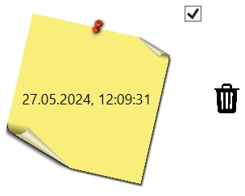<br>
Die zuvor erwähnte Checkbox dient nun zum Markieren der erledigten Notizen. Durch einfaches anklicken wird die Notiz als Erledigt markiert und diese Info auch wieder in der Datenbank gespeichert.

### Ändern einer Notiz
<br>
Wie vorher erwähnt, öffnet sich beim Anklicken der Notiz ein weiteres Fenster, indem man Änderungen vornehmen kann. Die beliebigen Änderungen werden einfach durchgeführt und durch das Schließen des Fensters werden die Änderungen gespeichert und in die Datenbank geladen.

### Löschen einer Notiz
<br>
Durch Klicken auf den Mistkübel wird die Notiz sofort in der App und der Datenbank gelöscht.


##  API-Beschreibung
Der Spring-Boot-Server basiert auf dem bekannten REST-Prinzip und stellt folgend auch die GET-, POST-, PUT-, und Delete-Endpoints zur Verfügung. Über diese können die Clients mit dem Server und dadurch auch mit der Datenbank kommunizieren. 

### Endpunkte
Endpunkte beginnen mit der IP-Adresse des Servers und dem Port. Anschließend wird dann der jeweilige Endpoint ergänzt.
```sh
ServerIPAdresse:8080 + Endpoint
```

<details>
  <summary>/ [GET]</summary>
  
  **Beschreibung:** Durch diesen Endpunkt kann man über den Browser auf das Service zugreifen <br>
  **Anwendung:**
  ```sh
  ServerIPAdresse:8080/
  ```
  Dieser Pfad muss in den Browser eingegeben werden, um das HTML-File zu erhalten.

</details>

<details>
  <summary>/api/notizen [GET]</summary>
  
  **Beschreibung:** Dieser Endpunkt wird verwendet, um die Notizen von der Datenbank zu empfangen.
  
  **JSON-Body:**
  kein JSON-Body notwendig

  **Return-Wert:**
  ```json
    {
        "id": "66544fa854ddd4767daab287",
        "title": "27.05.2024, 11:17:28",
        "text": "Hallo;Hello",
        "check": false
    },
    {
        "id": "66545bdb3e9a2a128ceab899",
        "title": "27.05.2024, 12:09:31",
        "text": "Fußballtraining;Volleyball;Essen;Schlafen",
        "check": true
    },
    ...
  ```
</details>

<details>
  <summary>/api/notiz [POST]</summary>
  
  **Beschreibung:** Dieser Endpunkt wird verwendet, um eine neue Notiz in die Datenbank zu laden.
  
  **JSON-Body:**
  ```json
    {
        "title": "31.05.2024, 13:09:30",
        "text": "Einkaufen",
        "check": "false"
    }
  ```

  **Return-Wert:**
  ```json
    {
        "id": "6659b02be187d06634b2ad88",
        "title": "31.05.2024, 13:09:30",
        "text": "Einkaufen",
        "check": false
    }
  ```
</details>

<details>
  <summary>/api/notiz [PUT]</summary>
  
  **Beschreibung:** Dieser Endpunkt wird verwendet, um eine bestehende Notiz zu überschreiben / zu verändern.
  
  **JSON-Body:**
  ```json
    {
        "id": "6659b02be187d06634b2ad88",
        "title": "31.05.2024, 13:09:30",
        "text": "Einkaufen Billa",
        "check": false
    }
  ```

  **Return-Wert:**
  ```json
    {
        "id": "6659b02be187d06634b2ad88",
        "title": "31.05.2024, 13:09:30",
        "text": "Einkaufen Billa",
        "check": false
    }
  ```
</details>

<details>
  <summary>/api/notiz/{id} [DELETE]</summary>
  
  **Beschreibung:** Dieser Endpunkt wird verwendet, um eine bestehende Notiz zu löschen.
  
  **JSON-Body:**
  Kein JSON-Body erforderlich. ID der Notiz wird an den Pfad des Endpoints angehängt.

  **Return-Wert:**
  Kein JSON-Returnwert.<br>
  Entweder Status-Code 200 --> OK oder Status-Code 500 --> Internal Server Error 

</details>

<br>

#### Weitere Endpunkte
Diese Endpunkte werden von dem Server zusätzlich noch unterstützt, finden in meinem Programm jedoch keine Anwendung. Vollständigkeitshalber werden sie in der Dokumentation aufgezählt, jedoch nicht detailliert mit dem JSON-Body und dem Return-Wert beschrieben.


<details>
  <summary>/api/notiz/{id} [GET]</summary>
  
  **Beschreibung:** Dieser Endpunkt kann verwendet werden, um auf eine bestimmte Notiz zuzugreifen.
</details>

<details>
  <summary>/api/notizen/{ids} [GET]</summary>
  
  **Beschreibung:** Dieser Endpunkt kann verwendet werden, um auf mehrere bestimmte Notizen zuzugreifen, jedoch nicht alle.
</details>

<details>
  <summary>/api/notizen/count [GET]</summary>
  
  **Beschreibung:** Dieser Endpunkt kann verwendet werden, um die Anzahl der Notizen in der Datenbank zu erfragen.
</details>

<details>
  <summary>/api/notizen [POST]</summary>
  
  **Beschreibung:** Dieser Endpunkt kann verwendet werden, um mehrere Notizen zu erstellen. 
</details>

<details>
  <summary>/api/notizen [PUT]</summary>
  
  **Beschreibung:** Dieser Endpunkt kann verwendet werden, um mehrere Notizen zu überschreiben / zu verändern.
</details>

<details>
  <summary>/api/notizen/{ids} [DELETE]</summary>
  
  **Beschreibung:** Dieser Endpunkt kann verwendet werden, um mehrere Notizen zu löschen.
</details>

<details>
  <summary>/api/notizen [DELETE]</summary>
  
  **Beschreibung:** Dieser Endpunkt kann verwendet werden, um alle Notizen zu löschen.
</details>


## Verwendung der API

Unterhalb wird als Beispiel die GET-Abfrage der Notizen genau aufgezeigt, um einen genauen Eindruck davon zu bekommen.

### Abfrage der Notizen


<details>
  <Summary>MongoDB Datenbank</summary>

  **Beschreibung:** Speicherung der Daten in der MongoDB Datenbank

  **MongoDB Dokument:**
  ```json
    {
        "_id": {
            "$oid": "66545bdb3e9a2a128ceab899"
        },
        "check": true,
        "text": "Fußballtraining;Volleyball;Essen;Schlafen",
        "title": "27.05.2024, 12:09:31"
    }
  ```
</details>

<details>
  <Summary>Spring-Boot-Server</summary>

  **Beschreibung:** Endpoint vom Spring-Boot-Server mit Java

  **Java-Endpoint:**
  ```java
    @GetMapping("notizen")
    public List<NotizDTO> getNotizen() {
        return notizService.findAll();
    }
  ```
  Im Hintergrund befindet sich dann noch die NotizDTO und die NotizEntity, welche für die Aufteilung in Objekte zuständig sind. Mit dem MongoDBNotizRepository kann dann auf die MongoDB Datenbank zugegriffen werden.
</details>

<details>
  <Summary>WPF Client</summary>

  **Beschreibung:** Empfangen der Notizen vom WPF Client aus.

  **C#-Code:**
  ```csharp
    public async Task<List<Notiz>> GetNotizenAsync()
    {
        List<Notiz> notizen = new List<Notiz>();
        string url = $"http://{serverAddress}:8080/api/notizen";

        using (var client = new HttpClient())
        {
            var response = await client.GetAsync(url);

            if (response.IsSuccessStatusCode)
            {
                string responseData = await response.Content.ReadAsStringAsync();
                //responseData = responseData.Replace(";", "\r\n");

                notizen = JsonSerializer.Deserialize<List<Notiz>>(responseData);        // Deserialisieren des JSON-Strings in eine Liste von Notiz-Objekten
                foreach (Notiz n in notizen)
                {
                    n.Replace();
                }
            }
            else
            {
                Console.WriteLine("Fehler beim Senden der GET-Anfrage: " + response.StatusCode);
            }
        }

        return notizen;
    }
  ```
  Mit der URL wird über einen HTTP-Client auf den Endpoint zugegriffen und auf die Response-Nachricht gewartet. Danach werden die JSON-Objekte in Notiz-Objekte deserialisiert und in der Liste gespeichert. Anschließend werden die ";" durch "\r\n" ersetzt, da diese nicht in der Datenbank gespeichert werden können, für die Darstellung im Programm jedoch essentziell sind.
</details>

<details>
  <Summary>HTML Client</summary>

  **Beschreibung:** Empfangen der Notizen vom HTML Client aus.

  **JS-Code:**
 ```js
    async function fetchNotesFromServer() {
        try {
            //const response = await fetch('http://10.10.3.7:8080/api/notizen');
            const response = await fetch('/api/notizen');


            if (response.ok) {          //Anfrage erfolgreich (Statuscode 200)
                const notesData = await response.json();
                notesData.forEach(note => {
                    let title = note.title;
                    let description = note.text.replace(/;/g, "\n");
                    let check = note.check;
                    let id = note.id;
                    let date = note.title;
                    let currentDate = new Date(),
                        month = months[currentDate.getMonth()],
                        day = currentDate.getDate(),
                        year = currentDate.getFullYear();
                    let noteInfo = {id, check, title, description, date: `${month} ${day}, ${year}`}
                    notes.push(noteInfo);
                    localStorage.setItem("notes", JSON.stringify(notes));

                });

            } else {
                console.error('Fehler beim Abrufen der Notizen. Statuscode: ' + response.status);
            }
        } catch (error) {
            console.error('Fehler beim Abrufen der Notizen:', error);
        }
    }
  ```
  Mit der URL wird hier über den fetch-Befehl auf den Endpoint zugegriffen und auf die Response-Nachricht gewartet. Dann wird jedes Element in der empfangenen Nachricht durchgegangen und die Variablen gelesen, um sie dann in den LocalStorage (dient in diesem Client als Ersatz für die Liste) zu speichern.
</details>


## Diskussion der Ergebnisse
Zum ersten Release wird hier die erste Version der Notiz-App vorgestellt. Die App kann sowohl über ein Programm auf den PC als auch in einem beliebigen Browser gestartet werden. Diese Lösung bietet in beiden Varianten eine ansprechende und selbsterklärende Benutzeroberfläche, um einen einfachen Betrieb zu gewährleisten. Dieses Programm basiert im Hintergrund auf einen Spring-Boot-Server, welcher für die Organisation und die Einbindung einer MongoDB-Datenbank zuständig ist. Notizen können so angelegt, geändert, erledigt oder auch gelöscht werden. Jede kleine Änderung wird sofort in der Datenbank gespeichert und kann so nicht verloren gehen. 

### Zusammenfassung
Die Notiz-App bietet eine ansprechende Benutzeroberfläche für mehrere Plattformen. Durch den Spring-Boot-Server im Hintergrund wird außerdem eine ständige Synchronisation zwischen Datenbank und Clients ermöglicht.

### Hintergründe
Bei der Entwicklung dieser Notiz-App wurde der Fokus auf eine benutzerfreundliche und einfache Bedienung gelegt, um dem Benutzer das Festhalten von Gedanken oder anderen Infos problemlos zu ermöglichen. Durch die verwendeten Technologien (C#, JavaScript, Spring-Boot, HTML, CSS, JavaScript, JSON) wird auch in Zukunft ein reibungsloser Betrieb gewährleistet.

### Ausblicke
In Zukunft soll nicht nur einfacher Text in einer Notiz gespeichert werden, dieser soll ebenfalls je nach Belieben unterschiedlich formatiert (Schriftart, fett, kursiv, usw.) werden können. Dies wird die Benutzererfahrung um einiges erhöhen und für mehr Freude am Benutzen dieser Lösung bieten. 


## Diagramme

### Sequenzdiagramm Übersicht alle Systeme
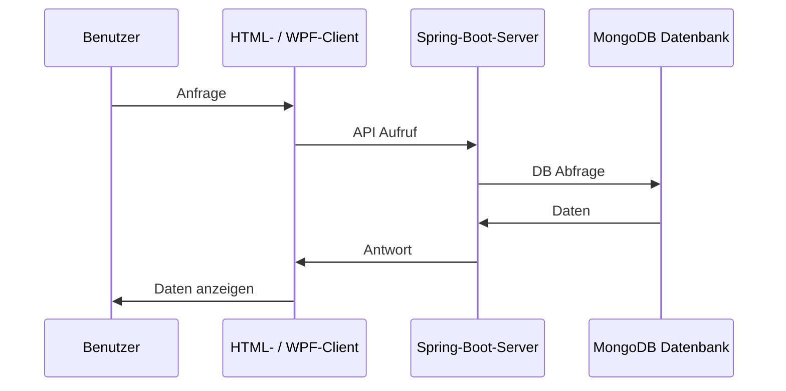

### Klassendiagramm des WPF Clients
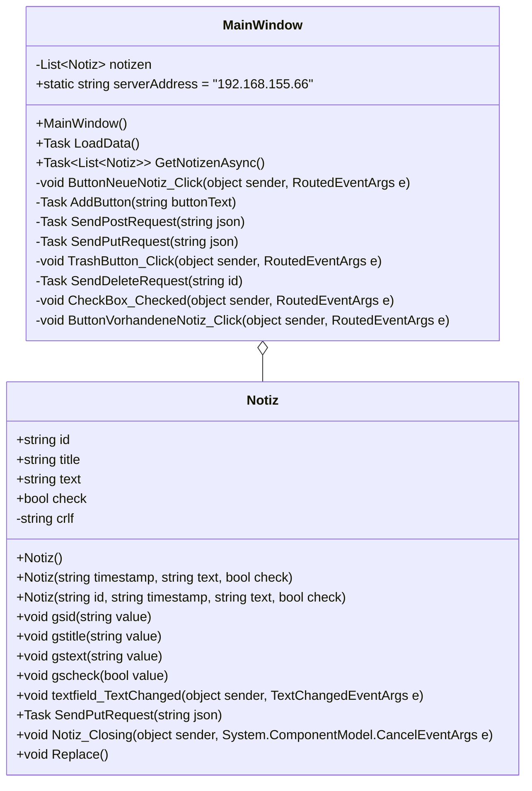

### Sequenzdiagramm WPF Client
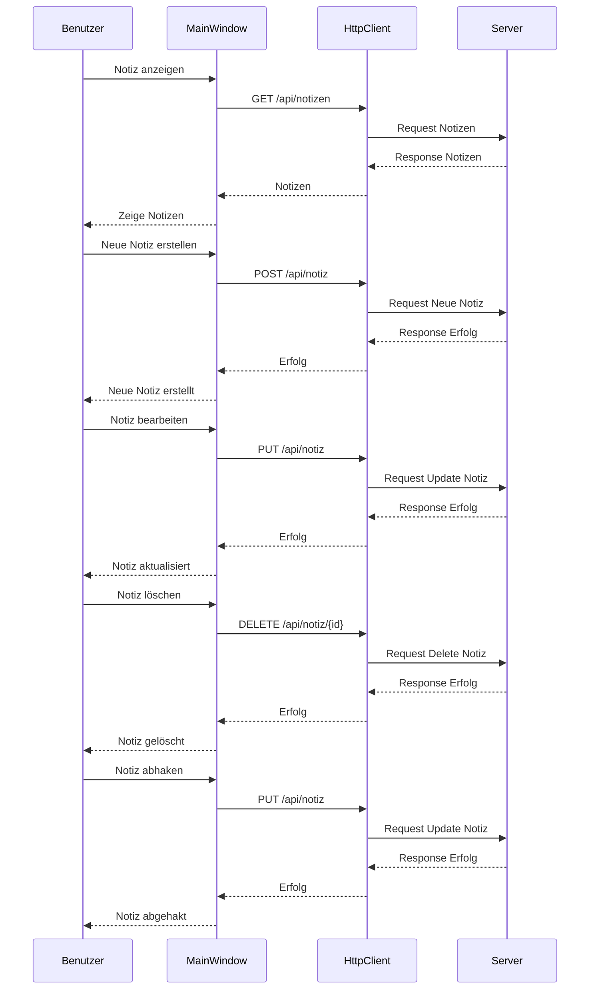

### Sequenzdiagramm HTML Client

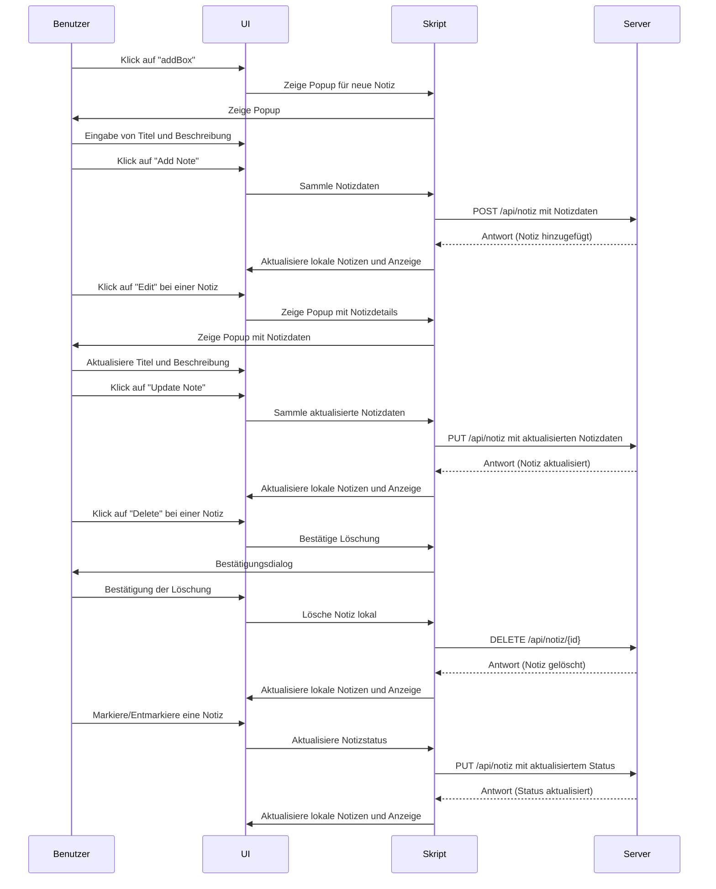


## Quellenverzeichnis


### Spring-Boot Server
#### [Spring-Boot]()
#### [JSON](https://www.json.org/json-en.html)


### WPF-Client
#### [C#](https://learn.microsoft.com/de-de/dotnet/csharp/)
#### [JSON](https://www.json.org/json-en.html)


### WebApp-Client
#### [HTML](https://developer.mozilla.org/en-US/docs/Web/HTML)
#### [CSS](https://developer.mozilla.org/en-US/docs/Web/CSS)
#### [JavaScript](https://developer.mozilla.org/en-US/docs/Web/JavaScript)
#### [JSON](https://www.json.org/json-en.html)


### MongoDB Datenbank
#### [MongoDB](https://www.mongodb.com/docs/)


### IDE & Nuggets
#### [IntelliJ IDEA 2022.2.1](https://www.jetbrains.com/idea/download/download-thanks.html?platform=windows)
   - ###### [Spring Boot Starter Data MongoDB 3.2.5](https://mvnrepository.com/artifact/org.springframework.boot/spring-boot-starter-data-mongodb/1.1.0.RELEASE)
   - ###### [Spring Boot Starter Web 3.2.5](https://mvnrepository.com/artifact/org.springframework.boot/spring-boot-starter-web)
#### [Visual Studio 2022 17.10.0](https://visualstudio.microsoft.com/de/thank-you-downloading-visual-studio/?sku=Community&channel=Release&version=VS2022&source=VSLandingPage&cid=2030&passive=false)


<br>
<br>
<br>
<br>
<br>
<br>

# DOKU noch nicht vollständig und fertig
noch zu erledigen: 
- Diagramme
- Powerpoint Präsentation

<br>
<br>
<br>
<br>
<br>


### Notiz App
- Softwaredesign (Architektur) 
- Beschreibung der Software (was tut sie und wozu ist sie gut) 
- API-Beschreibung
- Verwendung der API (ev. mit Code-Ausschnitten)
- Ev. Diagramme (Use-Cases, Übersichtsdiagramme)
- Diskussion der Ergebnisse (Zusammenfassung, Hintergründe, Ausblick, etc.)
- Quellenverzeichnis / Links
- Und wichtig: Die Grafiken müssen mittels Mermaid erstellt werden! (GitHub bietet eine Unterstützung für Mermaid-Diagramme)
