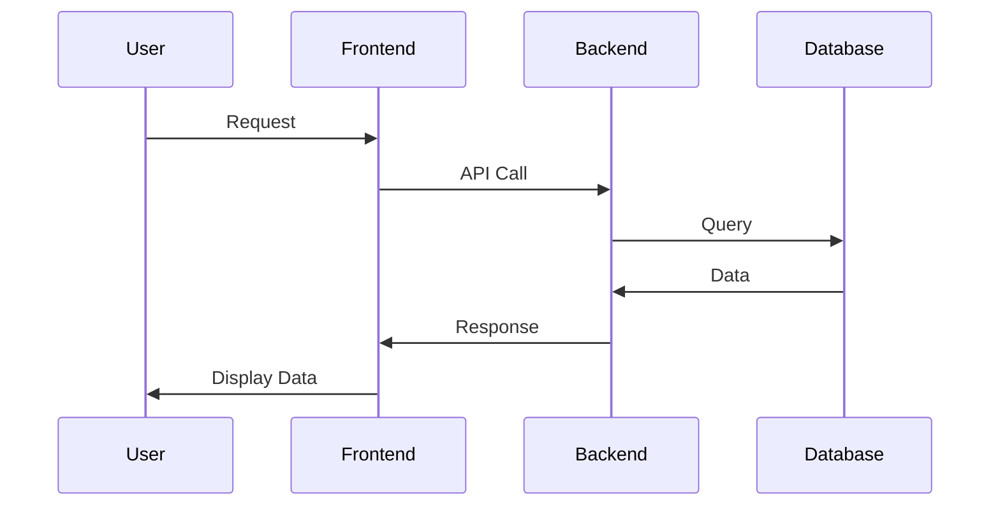
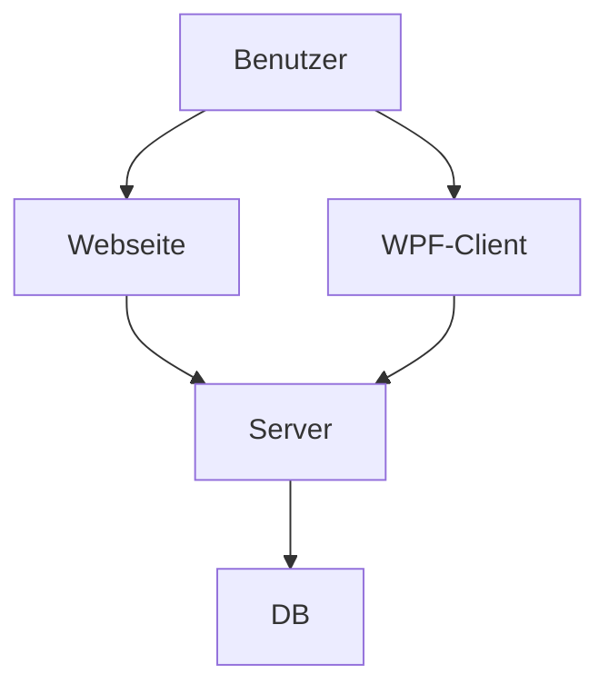

# POS Projekt 2024 - Notiz App - Paul Wasle

## Einleitung
Beschreibe hier kurz, worum es bei diesem Projekt geht. Zum Beispiel:

Dieses Projekt ist eine Beispielanwendung, die zeigt, wie man eine einfache API mit Node.js und Express erstellt.

## Installation
Erkläre, wie man das Projekt installiert und welche Voraussetzungen erfüllt sein müssen.

### Voraussetzungen
- Node.js (Version 14 oder höher)
- npm (Version 6 oder höher)

### Schritte
1. Klone das Repository:
    ```sh
    git clone https://github.com/username/repository.git
    ```
2. Wechsle in das Projektverzeichnis:
    ```sh
    cd repository
    ```
3. Installiere die Abhängigkeiten:
    ```sh
    npm install
    ```

## Benutzung
Beschreibe, wie man das Projekt benutzt.

### Starten der Anwendung
```sh
npm start
```

repository/
├── node_modules/
├── src/
│   ├── controllers/
│   ├── models/
│   ├── routes/
│   ├── app.js
├── test/
├── package.json
├── README.md

graph TD;
    A[Benutzer] --> B[Frontend]
    B --> C[Backend]
    C --> D[Database]



### Erklärung der Inhalte:

- **Einleitung**: Kurze Einführung und Ziel des Projekts.
- **Installation**: Schritte zur Installation und erforderliche Voraussetzungen.
- **Benutzung**: Anleitung zum Starten und Verwenden der Anwendung.
- **Architektur**: Beschreibung der Projektstruktur und visuelle Darstellung mittels Mermaid-Diagrammen.
- **API-Referenz**: Detaillierte Beschreibung der verfügbaren API-Endpunkte.
- **Datenflussdiagramm**: Visuelle Darstellung des Datenflusses innerhalb der Anwendung.
- **Tests**: Anleitung zum Ausführen von Tests.
- **Beitragende**: Liste der Projektmitarbeiter.
- **Lizenz**: Informationen zur Lizenzierung des Projekts.

Mermaid-Grafiken helfen dabei, die Architektur und den Datenfluss verständlicher darzustellen. Diese Vorlage kann nach Bedarf angepasst und erweitert werden.


---





### Notiz App
- Softwaredesign (Architektur) 
- Beschreibung der Software (was tut sie und wozu ist sie gut) 
- API-Beschreibung
- Verwendung der API (ev. mit Code-Ausschnitten)
- Ev. Diagramme (Use-Cases, Übersichtsdiagramme)
- Diskussion der Ergebnisse (Zusammenfassung, Hintergründe, Ausblick, etc.)
- Quellenverzeichnis / Links
- Und wichtig: Die Grafiken müssen mittels Mermaid erstellt werden! (GitHub bietet eine Unterstützung für Mermaid-Diagramme)
